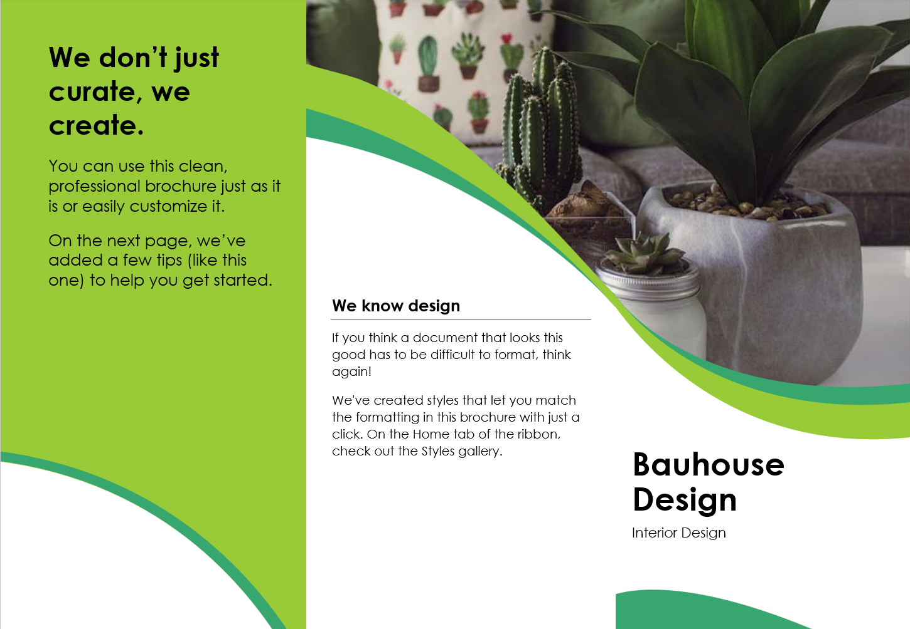

:::: layout-cover

::: cover-name
Student  
Name: ........................................
:::

::: cover-qualification
Level 1  
Ascentis Progression
:::

::: cover-code
Unit D/505/6398
:::

::: cover-title
# Word Processing Software
:::

::: cover-artwork
{width="9cm"}
:::

::::

::: layout-cover-dates
| Issue Date | Hand in Date | IV Date | Teacher Name |
| :---: | :---: | :---: | :---: |
| | | | |
:::

::: layout-page-break
:::

## Learning Outcomes and Assessment Criteria

In order to pass this unit, the evidence that the learner presents for assessment needs to demonstrate that they can meet all the learning outcomes for the unit. The assessment criteria determine the standard required to achieve the unit.

::: layout-assessment-criteria

+-------------------------------------------------------+-------------------------------------------------------+
| Learning Outcome (The learner will:)                  | Assessment Criteria (The learner can:)                |
+=======================================================+=======================================================+
| **1. Be able to enter, edit and combine text and      | **1.1** Identify what types of information are needed |
| other information within word processing              | in documents.                                         |
| documents**                                           |                                                       |
|                                                       | **1.2** Identify what templates are available and     |
|                                                       | when to use them.                                     |
|                                                       |                                                       |
|                                                       | **1.3** Use a keyboard or other input method to enter |
|                                                       | or insert text and other information.                 |
|                                                       |                                                       |
|                                                       | **1.4** Combine information of different types or     |
|                                                       | from different sources into a document.               |
|                                                       |                                                       |
|                                                       | **1.5** Enter information into existing tables, forms |
|                                                       | and templates.                                        |
|                                                       |                                                       |
|                                                       | **1.6** Use editing tools to amend document content.  |
|                                                       |                                                       |
|                                                       | **1.7** Store and retrieve document files             |
|                                                       | effectively, in line with local guidelines and        |
|                                                       | conventions where available.                          |
+-------------------------------------------------------+-------------------------------------------------------+
| **2. Be able to structure information within word     | **2.1** Create and modify tables to organise tabular  |
| processing documents**                                | or numeric information.                               |
|                                                       |                                                       |
|                                                       | **2.2** Select and apply heading styles to text.      |
+-------------------------------------------------------+-------------------------------------------------------+
| **3. Be able to use word processing software tools to | **3.1** Identify what formatting to use to enhance    |
| format and present documents**                        | presentation of the document.                         |
|                                                       |                                                       |
|                                                       | **3.2** Select and use appropriate techniques to      |
|                                                       | format characters and paragraphs.                     |
|                                                       |                                                       |
|                                                       | **3.3** Select and use appropriate page layout to     |
|                                                       | present and print documents.                          |
|                                                       |                                                       |
|                                                       | **3.4** Check documents meet needs, using IT tools    |
|                                                       | and making corrections as necessary.                  |
+-------------------------------------------------------+-------------------------------------------------------+

:::

::: layout-page-break
:::

## Your project: My interest guide

Make a guide about something you enjoy. Help someone new to the topic learn about it.

Build at least five pages: a cover, an automatic contents page and three short content pages. Use short paragraphs, pictures, lists and a table. You do not need five pages of solid writing!

### What to include

- Cover, automatic contents and three short content pages.
- Heading 1 and Heading 2; modify one style.
- Readable paragraphs, a list and a text box.
- A table you create and change; two images and a web link.
- Suitable A4 page layout and simple page numbers.
- Checked DOCX and PDF copies. Use the full checklist in Task 9.

### Where to start

Use guide-word-processing-skills.html from the student resource pack. Its steps match this booklet's task numbers. Your teacher will show you how to open it in a browser.

Explore the three template samples linked in the guide. Try changes in a saved copy, then choose a Word template or a blank document for your own guide.

Save your work in your own college OneDrive folder. You do not need Git or a code editor.

### Your evidence

Paste focused screenshots from your guide into the evidence boxes in Tasks 2–6. Keep the text readable: capture the relevant part, not the whole screen. Your teacher can also check the editable file or watch you demonstrate a skill. A printed guide can be handed in as additional evidence alongside this booklet.

::: layout-page-break
:::

## Start here: a short practice

Use Guide Step 0. This is practice before your assessed project.

1. Open a blank Word document. Type a heading and three sentences about an interest.
2. Fix a word, undo the change, then redo it.
3. Apply Heading 1 to the heading.
4. Save as Firstname-Surname-Practice.docx in your Word Processing folder.
5. Close it. Find the folder and reopen the document.

### Quick check

Show your teacher the saved document and its heading. Tell them which step you would like to practise again.

::: layout-page-break
:::

## Task 1: Explore and choose

Assessment criteria: 1.1, 1.2, 1.5. Use Guide Step 1.

1. Look at all three template samples. Save a copy of one and change its title and one heading style.
2. Look at the templates available in Word. Choose one, or a blank document, for your own guide.
3. Open topic-planning-form.docx. Complete your learner details and Section 1 now. Save your own copy. Leave its other sections until the matching project task.

### Your topic and information

What is your topic? Who will read your guide? Name two types of information they need, such as text, images or a table.

::: {.layout-textbox height="3.5cm" title="My topic, reader and information"}
*Name your topic and reader, then list two types of information they will need.*
:::

### Template choices

Name two available templates and say when each could be useful. Use short phrases.

| Template | When would you use it? |
| :--- | :--- |
| | |
| | |

Which template or blank start did you choose for your guide, and why?

::: {.layout-textbox height="3.5cm" title="I chose… because…"}
*Name your chosen template (or blank document) and give one reason it suits your guide.*
:::

::: layout-page-break
:::

## Task 2: Gather and add content

Assessment criteria: 1.3, 1.4. Use Guide Step 2.

1. Gather information from at least two sources overall. Choose two suitable images.
2. Type a short section in your own words. Insert the images and one meaningful web link.
3. Record your sources below. Use your own images or check that reuse is allowed; record any credit needed. Ask your teacher if unsure.
4. Complete Section 2 of your planning form as you work. You may write “see booklet source log” for source details already recorded here.

### Source log

| What I used | Source / web address | Permission or credit needed |
| :--- | :--- | :--- |
| Information | | |
| Image 1 | | |
| Image 2 | | |

### Check your work

Open the link. Can you read the text and see both images? Your teacher may also ask you to demonstrate inserting information.

### Screenshot evidence

::: {.layout-textbox height="5.5cm" title="Content screenshot"}
*Paste a readable snippet of your own text and an image. Include your link text if it is nearby.*
:::

::: layout-page-break
:::

## Task 3: Headings and contents

Assessment criteria: 2.2, 3.1. Use Guide Step 3.

1. Use Title and Subtitle on the cover. Use Heading 1 for your main sections and Heading 2 for at least one smaller section.
2. Modify one heading style. Check that other headings using it change too.
3. Use page breaks to make room for the cover and contents. Insert automatic contents on page 2.
4. Update the whole contents table when your headings or pages change.
5. Complete Section 3 of the planning form. Heading 3 is optional; Heading 1 and Heading 2 are enough.

### Make a choice

Name one style change and explain how it helps your reader.

::: {.layout-textbox height="3.5cm" title="I changed… This helps because…"}
*Name the heading style you changed and explain how that change helps your reader.*
:::

### Check your work

Check that both heading levels appear in your contents. 

### Screenshot evidence

::: {.layout-textbox height="5.5cm" title="Headings and contents screenshots"}
*Paste your contents and a heading with its style selected. Two small snippets are fine.*
:::

::: layout-page-break
:::

## Task 4: Make text easy to read

Assessment criteria: 3.1, 3.2. Use Guide Step 4.

1. Modify Normal style to set a clear font, size and paragraph spacing. Use 12pt or larger if it helps your reader.
2. Make one list using Word's bullet or numbering button.
3. Add a text box containing a useful tip or key fact. Keep it easy to read.
4. Complete Section 4 of the planning form now. You may choose a larger body font than its suggested 12pt.

### Make a choice

What did you change to make the text easier to read?

::: {.layout-textbox height="3.5cm" title="My change and why it helps"}
*Describe one change to the font, spacing or layout, and say why it makes reading easier.*
:::

### Check your work

Can you read your text box? Is the spacing consistent? Check your list uses Word's list tool rather than typed symbols.

### Screenshot evidence

::: {.layout-textbox height="5.5cm" title="List and text box screenshots"}
*Paste your list and tip box here. Crop out unrelated parts of the screen.*
:::

::: layout-page-break
:::

## Task 5: Create and change a table

Assessment criterion: 2.1. Use Guide Step 5.

1. Create your own small table, such as item / fact / tip. Add headings and at least two rows of information.
2. Add another row or column. Enter information into it.
3. Adjust the widths and choose a clear table style with visible borders.

### Record your change

What row or column did you add? How did you make it fit? Your teacher can also watch you demonstrate this.

::: {.layout-textbox height="3.5cm" title="My table change"}
*Say which row or column you added and how you adjusted the table to fit.*
:::

### Check your work

Read the table across a row. Is it clear which heading each fact belongs to?

### Screenshot evidence

::: {.layout-textbox height="5.5cm" title="Table screenshot"}
*Paste your finished table with its column headings and new row or column visible.*
:::

::: layout-page-break
:::

## Task 6: Check the page layout

Assessment criterion: 3.3. Use Guide Step 6.

1. Choose A4 paper, suitable orientation and margins.
2. Use page breaks where a new section should start on a new page. Add simple page numbers.
3. Open print preview. Check every page for cut-off text, empty pages and awkward image positions.

### Record your check

What did you check or fix in print preview?

::: {.layout-textbox height="3.5cm" title="My page layout check"}
*Name something you checked in print preview and any change you made.*
:::

### Optional challenge

Try a running header, Page X of Y, or an extra heading level. These are extensions, not core requirements.

### Screenshot evidence

::: {.layout-textbox height="5.5cm" title="Page layout screenshot"}
*Paste a page-layout or print-preview snippet. Make the page number readable.*
:::

::: layout-page-break
:::

## Task 7: Review and improve

Assessment criteria: 1.6, 3.4. Use Guide Step 7.

1. Run Word's spelling/editor tool. Decide which suggestions make sense.
2. Ask a partner to read your guide: what is clear, and what needs improving? Ask your teacher if no partner is available.
3. Use editing tools to make two useful corrections. Fix any other problems you find too.

### Feedback

Reviewer name and one suggestion:

::: {.layout-textbox height="3.5cm" title="Feedback from my reader"}
*Write the reviewer’s name and one useful suggestion they gave you.*
:::

### My corrections

Short notes are enough. Name the tool, such as Editor, Find and Replace, or cut and paste.

| Before | Tool I used | After |
| :--- | :--- | :--- |
| | | |
| | | |

::: layout-page-break
:::

## Task 8: Save, reopen and export

Assessment criterion: 1.7. Use Guide Step 8.

1. Save your guide as Firstname-Surname-InterestGuide.docx in your Word Processing folder.
2. Close the document. Open your folder and reopen the saved file. Make a small edit and save again.
3. Export a PDF in the same folder. Open it, check all pages and test the hyperlink.

### Find my files

Record your folder and file names. Do not include passwords or private sharing links.

::: {.layout-textbox height="3.5cm" title="My folder and guide file names"}
*Write your folder location and DOCX/PDF file names. Do not include passwords.*
:::

### Retrieval check

Demonstrate opening your saved file from its folder to your teacher.

| Teacher check | Date / initials |
| :--- | :--- |
| Learner located and reopened their saved guide | |

::: layout-page-break
:::

## Task 9: Ready to hand in?

Assessment criteria: 3.1, 3.4. Use Guide Step 9.

Check your actual document. Fix any missing items before ticking them. Update your contents and export the PDF again after your final changes.

| Core requirement | Done? |
| :--- | :---: |
| Cover: Title, subtitle, name and image | |
| Length: Cover + automatic contents + three short content pages | |
| Headings: Heading 1 and Heading 2; modify one style | |
| Body text: Readable size (12pt or larger) and spacing | |
| List: One bullet or numbered list | |
| Table: Create a table with headings and borders; add a row or column | |
| Images: Two images with source details | |
| Text box: One tip or key fact in a text box | |
| Link: One working hyperlink with meaningful text | |
| Pages: Suitable A4 layout, page breaks and page numbers | |
| Check: Use editing tools, act on feedback and record two corrections | |
| Files: Save/reopen DOCX; export and check PDF | |

::: layout-page-break
:::

## Final reflection and hand-in

### Final thought

What helps your reader most? What would you improve next time? One short sentence for each is enough.

::: {.layout-textbox height="3.5cm" title="My final thoughts"}
*Write one thing that helps your reader and one thing you would improve next time.*
:::

### Hand in these four files

- Your guide as DOCX.
- Your guide as PDF.
- Your completed topic planning form.
- This completed booklet with screenshot evidence.

You may also hand in a printed copy of your guide as additional evidence.

Teacher: write the class hand-in location here: __________________________

::: layout-page-break
:::

## Assessor record

Check each criterion against the editable guide, form, booklet and any observed demonstration. Record a file/page/task or dated observation; specify further action where needed.

| Criterion | Met? | Evidence location / further action |
| :--- | :---: | :--- |
| 1.1 | | |
| 1.2 | | |
| 1.3 | | |
| 1.4 | | |
| 1.5 | | |
| 1.6 | | |
| 1.7 | | |
| 2.1 | | |
| 2.2 | | |
| 3.1 | | |
| 3.2 | | |
| 3.3 | | |
| 3.4 | | |

Decision: [ ] Pass  [ ] Resubmission required

Assessor name: ____________________  Date: ____________________

Assessor signature: ____________________

::: layout-page-break
:::

## Student declaration of authenticity

::: layout-declaration
I confirm that this guide, planning form and booklet are my own work. I have recorded the sources I used and any help I received.

[ ] I confirm this is my own work.

Learner name: ____________________

Learner ID: ____________________

Date: ____________________

Signature: ____________________
:::
